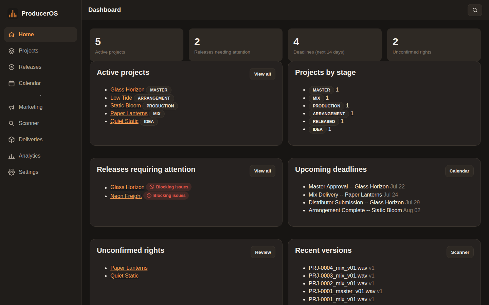

# ProducerOS

Local-first music production management for a producer using FL Studio on
Windows. Projects, versions, audio assets, contributors, rights, releases,
marketing plans, deadlines, delivery packages, and analytics -- in one
dark-themed dashboard usable from a Windows desktop browser and from an
Android phone as an installable PWA over your home network.

**No API keys. No cloud services. No Docker. No internet after install.**
Everything runs and stays on your machine; your unreleased music never
leaves it, and ProducerOS never modifies an audio file without an
explicitly approved, logged operation.



## Quick start (Windows, from a release)

1. Download `ProducerOS-vX.Y.Z-windows.zip` from Releases, verify its
   `.sha256`, and extract it.
2. Run `ProducerOS.exe`. Migrations apply automatically; your browser
   opens to the dashboard.
3. Create your admin account on the first-run setup page.

Full walkthrough: [docs/INSTALL_WINDOWS.md](docs/INSTALL_WINDOWS.md).
Phone access: [docs/ANDROID_PWA.md](docs/ANDROID_PWA.md).

## Quick start (from source, any OS)

Requires Python 3.12.

```bash
git clone https://github.com/AgentMindCloud/ProdOS.git
cd ProdOS
python3.12 -m venv .venv
source .venv/bin/activate          # Windows: .venv\Scripts\Activate.ps1
pip install -e ".[dev]"
python -m produceros.cli run       # starts on http://127.0.0.1:8420/
```

On Windows the equivalent is `.\scripts\setup_windows.ps1` then
`.\scripts\run_desktop.ps1`.

Try it with realistic synthetic sample data:

```bash
python -m produceros.cli demo-load    # 2 artists, 6 projects, releases, deadlines...
python -m produceros.cli demo-clean   # removes exactly what demo-load created
```

## Running the tests

```bash
pytest tests/unit tests/integration tests/security -q   # 119 tests
pytest tests/e2e -q                                     # 4 tests, real Chromium via Playwright
ruff check src tests && mypy src
```

## Documentation

| | |
|---|---|
| [docs/USER_GUIDE.md](docs/USER_GUIDE.md) | Feature walkthrough |
| [docs/ADMIN_GUIDE.md](docs/ADMIN_GUIDE.md) | Configuration, data directory, operations |
| [docs/INSTALL_WINDOWS.md](docs/INSTALL_WINDOWS.md) | Install / build on Windows |
| [docs/ANDROID_PWA.md](docs/ANDROID_PWA.md) | LAN pairing + PWA install on Android |
| [docs/BACKUP_RESTORE.md](docs/BACKUP_RESTORE.md) | Backups, restore, data export |
| [docs/RELEASE_PROCESS.md](docs/RELEASE_PROCESS.md) | Idea-to-delivered-release workflow |
| [docs/DATA_MODEL.md](docs/DATA_MODEL.md) | Schema as implemented |
| [docs/SECURITY_MODEL.md](docs/SECURITY_MODEL.md) | Auth, CSRF, file safety, LAN pairing |
| [docs/MCP.md](docs/MCP.md) | Optional local MCP server for AI assistants |
| [docs/TROUBLESHOOTING.md](docs/TROUBLESHOOTING.md) | Common problems |
| [docs/PRODUCT_SPEC.md](docs/PRODUCT_SPEC.md) | The original, verbatim specification |
| [docs/adr/](docs/adr/) | Architecture decision records |
| [ARCHITECTURE.md](ARCHITECTURE.md) | Code layout and how the pieces fit |
| [AGENTS.md](AGENTS.md) | Non-negotiable rules for contributors (human or AI) |
| [CONTRIBUTING.md](CONTRIBUTING.md) | Development workflow |
| [HANDOFF.md](HANDOFF.md) | Current project state for whoever works on it next |

## License

MIT -- see [LICENSE](LICENSE).
