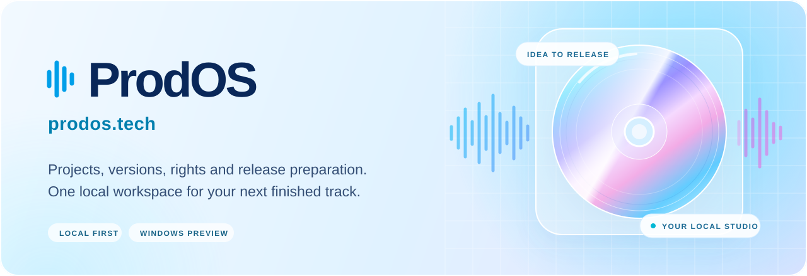
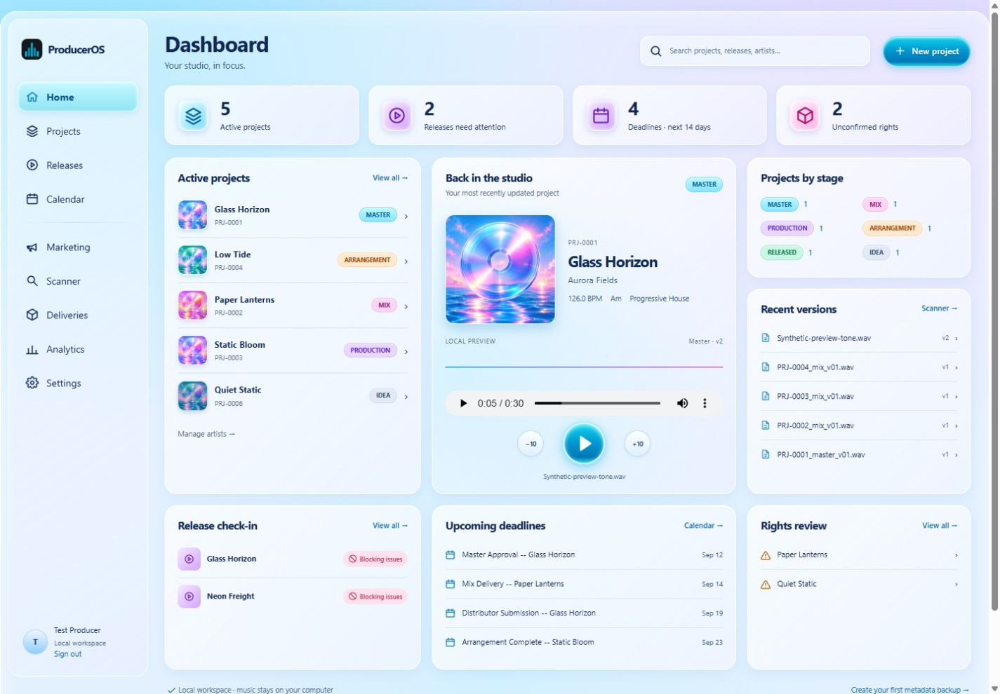
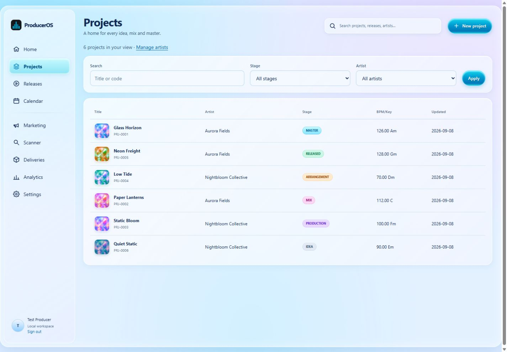
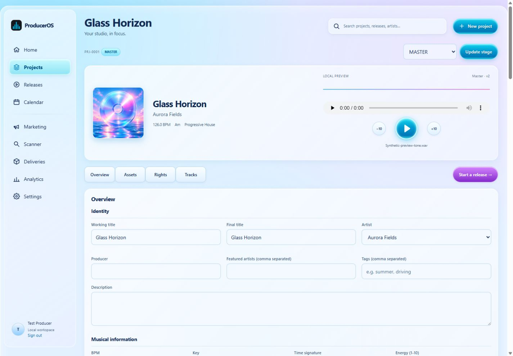

<p align="center">
  <a href="https://prodos.tech/">
    
  </a>
</p>

<p align="center">
  <a href="https://prodos.tech/"><strong>Explore prodos.tech</strong></a>
  &nbsp; · &nbsp;
  <a href="https://github.com/AgentMindCloud/ProdOS/releases/tag/preview-0.2.0"><strong>Download Windows preview</strong></a>
  &nbsp; · &nbsp;
  <a href="https://github.com/AgentMindCloud/ProdOS/issues">Feedback &amp; ideas</a>
</p>

## Your studio, in focus

Local-first music production management for a producer using FL Studio on
Windows. Projects, versions, audio assets, contributors, rights, releases,
marketing plans, deadlines, delivery packages, and analytics -- in one
visual blue studio dashboard in a Windows desktop browser, with a responsive
phone layout and optional PWA access over your home network. Physical-device
PWA installation has not been verified in the September 2026 review.

**No API keys. No cloud services. No Docker. No internet after install.**
Everything runs and stays on your machine; your unreleased music never
leaves it, and ProducerOS never modifies an audio file without an
explicitly approved, logged operation.

<p align="center">
  
  <br />
  <sub>The workspace at a glance · synthetic demo projects</sub>
</p>

<table>
  <tr>
    <td width="50%"></td>
    <td width="50%"></td>
  </tr>
  <tr>
    <td align="center"><sub>Keep your projects in view</sub></td>
    <td align="center"><sub>Bring the details together</sub></td>
  </tr>
</table>

## Try ProdOS 0.2.0

**[Website and interactive demo](https://prodos.tech/)** ·
**[Windows preview download](https://github.com/AgentMindCloud/ProdOS/releases/tag/preview-0.2.0)**

The redesigned UI and bug fixes are included in this source tree. The
`ProducerOS-0.2.0-Windows.zip` release download includes Python; extract
the complete folder and run `ProducerOS.exe`.
Follow [these instructions](docs/review-2026-09-09/WINDOWS_PORTABLE.txt).
This is an unsigned portable preview, tested on one Windows machine. It is
not a new installer or a certified clean-machine upgrade. The bundled
**0.1.0 installer still contains the previous UI**.

See the [review, verification and hosting assessment](docs/review-2026-09-09/REVIEW.md).
Registered local audio can now play in the dashboard/project detail after
its folder is added to Scanner or set as the project's root folder. No
music upload, cloud account or runtime network dependency was added.

## Quick start (Windows)

1. Download **`ProducerOS-0.2.0-Windows.zip`** from the
   [preview release](https://github.com/AgentMindCloud/ProdOS/releases/tag/preview-0.2.0)
   or [prodos.tech](https://prodos.tech/#download).
2. Choose **Extract All**. Keep the complete extracted `ProducerOS` folder
   together, including `_internal`.
3. Run `ProducerOS.exe`. It opens your local app in your browser. Create
   your local login, then start with a test project.

Before trying the preview with an existing library, back up the app database
and your music separately, and quit any running older copy through Settings.
Clean-machine installation and upgrades have not been verified. The legacy
installer guide is [docs/INSTALL_WINDOWS.md](docs/INSTALL_WINDOWS.md).
Optional home-network phone access: [docs/ANDROID_PWA.md](docs/ANDROID_PWA.md).

**Setting this up for someone non-technical?** Give them
[START-HERE.txt](START-HERE.txt) -- plain-language install steps with no
jargon -- and see
[docs/SHARING_WITH_SOMEONE.md](docs/SHARING_WITH_SOMEONE.md). Send the website
or preview-release link; a GitHub account is not required to download.
**Code → Download ZIP** downloads the source tree and the old bundled
installer, not the current portable app.

## Quick start (from source, any OS)

Requires Python 3.12.

```bash
git clone https://github.com/AgentMindCloud/ProdOS.git
cd ProdOS
python3.12 -m venv .venv
source .venv/bin/activate          # Windows: .venv\Scripts\Activate.ps1
pip install -e ".[dev]"
python -m produceros.cli run       # starts on http://127.0.0.1:8420/
```

On Windows the equivalent is `.\scripts\setup_windows.ps1` then
`.\scripts\run_desktop.ps1`.

Try it with realistic synthetic sample data:

```bash
python -m produceros.cli demo-load    # 2 artists, 6 projects, releases, deadlines...
python -m produceros.cli demo-clean   # removes exactly what demo-load created
```

## Running the tests

```bash
pytest tests/unit tests/integration tests/security -q   # Windows review: 161 passed, 3 skipped
pytest tests/e2e -q                                     # 6 tests, real Chromium via Playwright
ruff check src tests && mypy src
```

## Documentation

| | |
|---|---|
| [docs/USER_GUIDE.md](docs/USER_GUIDE.md) | Feature walkthrough |
| [docs/ADMIN_GUIDE.md](docs/ADMIN_GUIDE.md) | Configuration, data directory, operations |
| [docs/INSTALL_WINDOWS.md](docs/INSTALL_WINDOWS.md) | Install / build on Windows |
| [docs/ANDROID_PWA.md](docs/ANDROID_PWA.md) | LAN pairing + PWA install on Android |
| [docs/BACKUP_RESTORE.md](docs/BACKUP_RESTORE.md) | Backups, restore, data export |
| [docs/RELEASE_PROCESS.md](docs/RELEASE_PROCESS.md) | Idea-to-delivered-release workflow |
| [docs/BUILDING.md](docs/BUILDING.md) | Building the Windows installer, cutting a release |
| [docs/DATA_MODEL.md](docs/DATA_MODEL.md) | Schema as implemented |
| [docs/SECURITY_MODEL.md](docs/SECURITY_MODEL.md) | Auth, CSRF, file safety, LAN pairing |
| [docs/MCP.md](docs/MCP.md) | Optional local MCP server for AI assistants |
| [docs/TROUBLESHOOTING.md](docs/TROUBLESHOOTING.md) | Common problems |
| [docs/PRODUCT_SPEC.md](docs/PRODUCT_SPEC.md) | The original, verbatim specification |
| [docs/adr/](docs/adr/) | Architecture decision records |
| [ARCHITECTURE.md](ARCHITECTURE.md) | Code layout and how the pieces fit |
| [AGENTS.md](AGENTS.md) | Non-negotiable rules for contributors (human or AI) |
| [CONTRIBUTING.md](CONTRIBUTING.md) | Development workflow |
| [START-HERE.txt](START-HERE.txt) | Plain-language install steps to hand to a non-technical user |
| [docs/SHARING_WITH_SOMEONE.md](docs/SHARING_WITH_SOMEONE.md) | How to get the installer and send it to someone |
| [HANDOFF.md](HANDOFF.md) | Current project state for whoever works on it next |

## License

MIT -- see [LICENSE](LICENSE).
